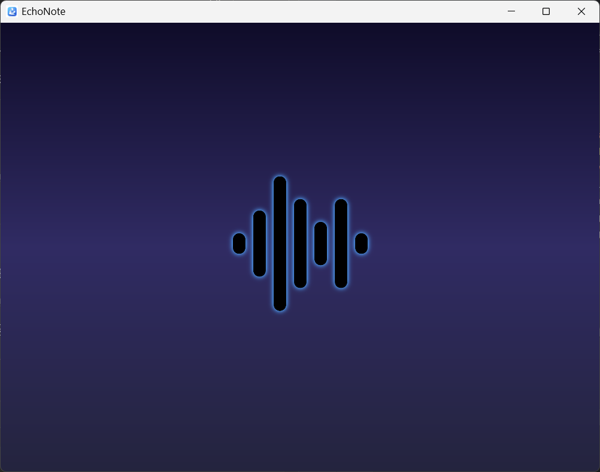
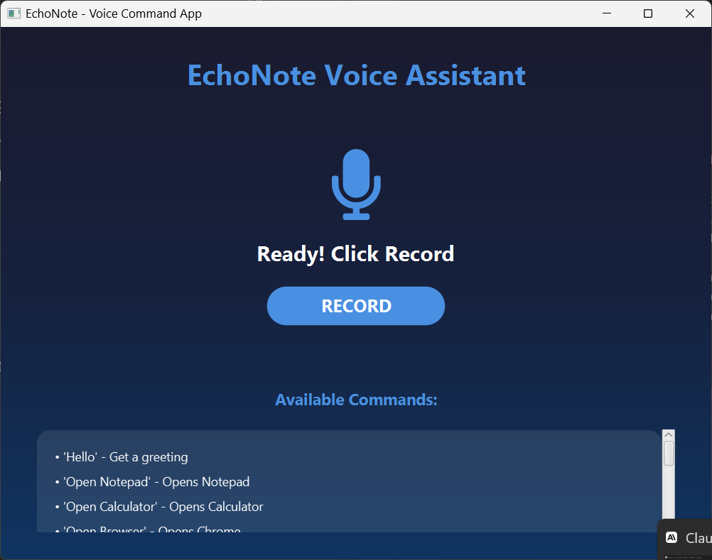
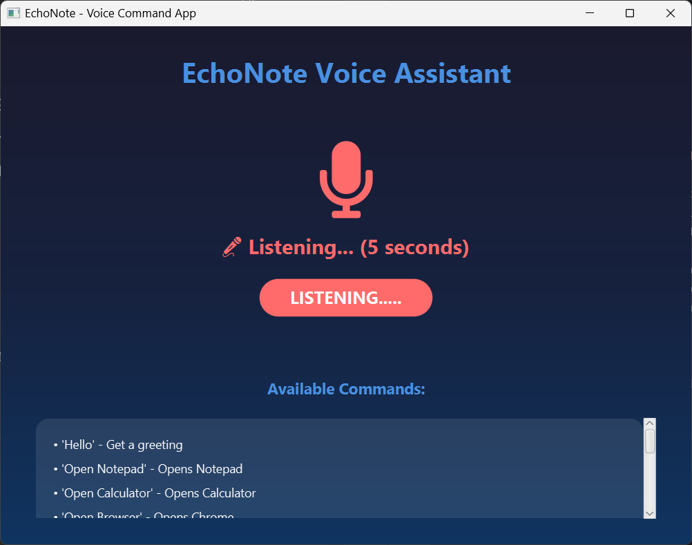
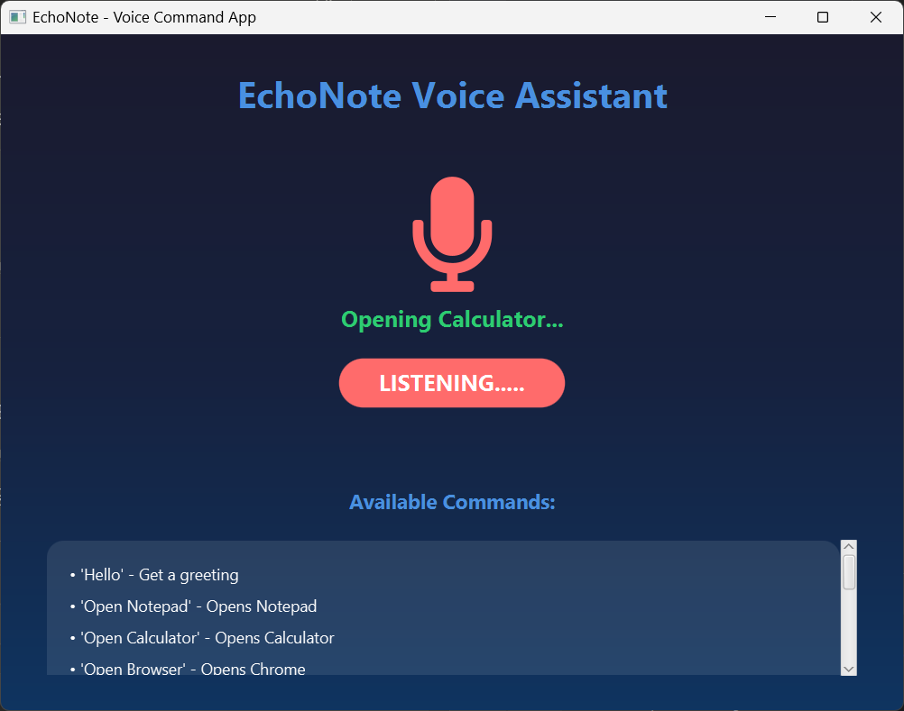

# 🎤 EchoNote - Voice Command Speech Recognition App

A modern JavaFX desktop application that converts voice commands into text and executes system commands using cloud-based speech recognition.


## ✨ Features

- **Real-time Speech Recognition** - Powered by AssemblyAI cloud API
- **Beautiful Animated Splash Screen** - Professional startup animation with wave effects
- **Voice Command Execution** - Execute system commands using voice
- **Modern UI Design** - Dark gradient theme with animated microphone icon
- **Multiple Commands Supported** - See list below

### Available Voice Commands

| Command | Action |
|---------|--------|
| "Hello" | Greeting response |
| "Open Notepad" | Opens Windows Notepad |
| "Open Calculator" | Opens Windows Calculator |
| "Open Browser" | Opens Chrome browser |
| "Open File Explorer" | Opens Windows File Explorer |
| "Create Folder" | Creates a new folder on Desktop |
| "What time is it" | Displays current time |
| "What's the date" | Displays current date |
| "Shutdown" | Initiates system shutdown (60s delay) |
| "Cancel" | Cancels pending shutdown |
| "Close App" | Exits the application |

## Technologies Used

- **Java 24** - Programming language
- **JavaFX 17** - UI framework
- **AssemblyAI API** - Speech-to-text cloud service
- **OkHttp** - HTTP client for API requests
- **Maven** - Build and dependency management
- **BootstrapFX** - UI styling
- **Ikonli** - Icon library (FontAwesome)
- **ControlsFX** - Additional UI controls

## Requirements

- Java 17 or higher
- Internet connection (for AssemblyAI API)
- Working microphone
- Windows OS (for system commands)

## Installation & Setup

### 1. Clone the Repository
```bash
git clone https://github.com/bishopttw/EchoNote.git
cd EchoNote
```

### 2. Get AssemblyAI API Key

1. Go to [AssemblyAI](https://www.assemblyai.com/)
2. Sign up for a free account
3. Copy your API key

### 3. Add API Key to Project

Open `src/main/java/com/example/echonote/AssemblyAISpeechRecognizer.java` and replace:
```java
private static final String API_KEY = "YOUR_API_KEY_HERE";
```

With your actual API key.

### 4. Build the Project
```bash
mvn clean install
```

### 5. Run the Application
```bash
mvn javafx:run
```

Or run `HelloApplication.java` from your IDE.

## How to Use

1. **Launch the app** - Beautiful splash screen appears
2. **Click RECORD button** - Microphone icon turns red and pulses
3. **Speak clearly** - Say your command within 5 seconds
4. **Wait for processing** - Status shows "Processing..."
5. **Command executes** - Result appears, button auto-resets after 3 seconds
6. **Ready for next command!** - Repeat as needed

## Screenshots

### Splash Screen


### Main Interface


### Voice Recognition Active


### Command Execution


## 🏗️ Project Structure
```
EchoNote/
├── src/
│   ├── main/
│   │   ├── java/com/example/echonote/
│   │   │   ├── HelloApplication.java      # Main entry point
│   │   │   ├── HelloController.java       # Main UI controller
│   │   │   ├── SplashController.java      # Splash screen controller
│   │   │   ├── AssemblyAISpeechRecognizer.java  # Speech recognition
│   │   │   ├── CommandProcessor.java      # Command execution logic
│   │   │   └── SpeechResultListener.java  # Callback interface
│   │   └── resources/com/example/echonote/
│   │       ├── hello-view.fxml           # Main UI layout
│   │       ├── splash-view.fxml          # Splash screen layout
│   │       └── images/                   # App icons
├── pom.xml                               # Maven dependencies
└── README.md                             # This file
```

## Learning Journey

This project taught me:
- How to integrate cloud APIs into desktop applications
- Speech recognition concepts and implementation
- JavaFX UI design and animations
- Handling async operations with threads

**Challenges I faced:**
- Initially tried Vosk (offline) but it was too slow for my PC
- Learned about audio format conversion (WAV headers)
- Debugging AssemblyAI API responses


## 🎓 Educational Project

This project was developed as a school assignment to demonstrate:
- JavaFX application development
- Cloud API integration
- Speech recognition implementation
- Modern UI/UX design
- Software architecture and design patterns

## Author

**CHUKWUMA PRINCE**  
*Computer Science Student*  
NATIONAL INSTITUTE OF INFORMATION TECHNOLOGY (NIIT)

## License

Educational Project - NATIONAL INSTITUTE OF INFORMATION TECHNOLOGY (NIIT) © 2026

## Acknowledgments

- AssemblyAI for providing the speech recognition API
- JavaFX team for the UI framework

## Note

This application requires an active internet connection to use the AssemblyAI speech recognition service. The free tier provides 60 minutes of transcription per month.

---
